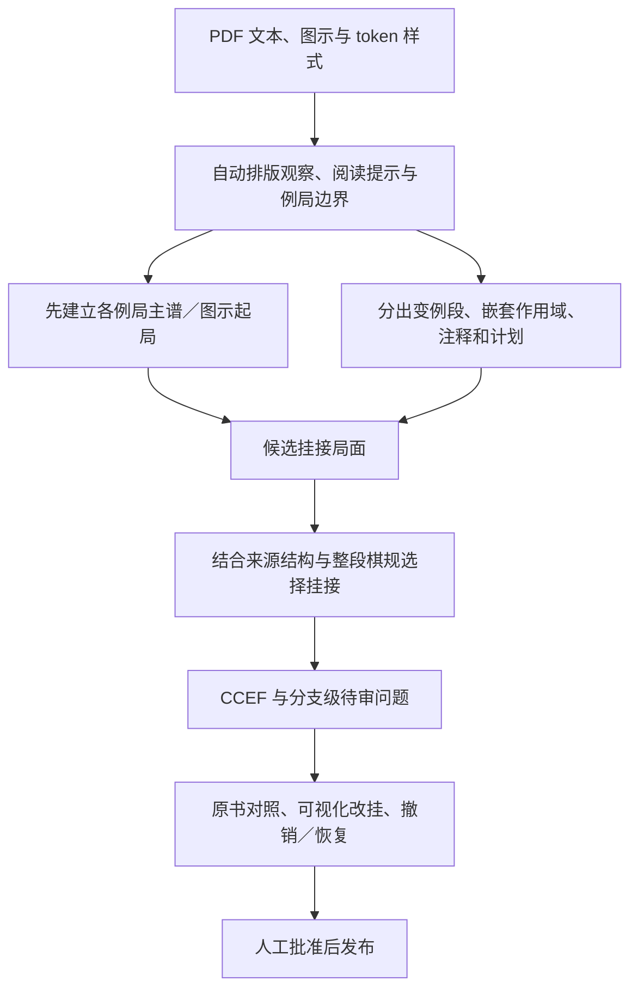

# v6 网页实跑复核与下一轮提取／审核设计

日期：2026-09-25。状态：接线和补全额度已验证；方案按后续讨论更新，结构改造尚未实施。
开发顺序与逐步验收以 [R1–R5 执行计划](pdf-extraction-r1-r5-plan-2026-09-25.md) 为准。
本稿补充 ADR 0022，不代表 P6 验收通过。页码均为 PDF 物理页。

## 1. 本轮范围与结论

用户要求先验证 v6 接线与旧补全额度，再分析最近两次网页提取，讨论新的提取与修复方案。
本轮读取生产库、原 PDF 页面、保存的请求／响应和 CCEF，并离线重放；没有新 DeepSeek 调用，
没有修改生产数据、审核内容或重新提取任务，没有实施下面提议的新架构。

结论：**接线正常，任务可完成并保留待审内容，但语义质量不能验收。问题包含版式信息丢失、
模型误判、局部修复器误改挂接、跨块错误传播；不能归结为推理额度不足。**

## 2. 接线与额度验证

- `SourcesPage.tsx` 默认 `source_first`；“重新提取同一页段”使用当前选择，而非继承旧 run 版本。
- `schemas/pdf.py` 的 HTTP 请求默认 `source_first`；API 映射到 `pdf-extraction:v6`。
  显式 `legacy` 仍映射 v4，底层持久化历史默认 v2 不改。
- `coverage.py` 不再把补全请求截到 8192，使用 `context.max_output_tokens`。
  当前有效配置为 **128000**。本次恢复的是 coverage/variation 补全的额度，不泛改其他旧恢复步骤。
- `pdf_extraction.py` 为生产 v4 恢复单独建立 recovery provider，避免主 provider 的 thinking/high
  覆盖 recovery/none 设置；测试注入的 scripted provider 仍可复用。
- 相关后端四个测试文件 70 passed；前端“新建提取”“旧任务用当前选项重提”2 passed。
  7 个相关 Python 文件 Ruff/MyPy 通过；前端 TypeScript、3 个相关文件 ESLint/Prettier 通过；
  OpenAPI/TS 已重新生成并核对。验证中补上前次中断遗留的 pytest 导入，并修正两个现有局部类型错误
  （source read 测试返回值 cast、审核页可选 items 访问）。没有运行全局验收或 coverage。
- 生产库最近两条任务本身就是 v6/succeeded，且各自有 semantic_manifest 和 normalized_ccef。
  检查时本地 8000 端口没有运行服务，因此本轮没有额外声称完成现场浏览器点击验收；
  使用实际持久化结果、HTTP 集成测试和前端交互测试验证。未新建付费任务。

## 3. 两次实跑的基线

| 样本 | Run ID | 页段 | 模型块数 | 棋步节点 | 非法节点 | unresolved 项 |
| --- | --- | --- | ---: | ---: | ---: | ---: |
| The Catalan – Move By Move | `3ca28e55-c8ec-5548-84df-48a9d0c63514` | 6–9 | 5 | 141 | 27 | 12 |
| Magnus Wins With White（Zenon Franco） | `be46d17a-7287-5e17-a682-1eedbfca4259` | 137–149 | 15 | 196 | 110 | 74 |

Catalan 创建于 07:03:41 UTC，Magnus 创建于 07:08:16 UTC。第二本上传文件为
`data/sources/pdf/3a/3afdaae884df1a89839e2da1bd204430e0bedfa8c5cdf80bfea15a26a28c993b.pdf`。
20 个保存响应全部 `finish_reason=stop`，不是预算截断。使用当前代码和保存响应离线重放，
两本均复现完全相同的节点／非法节点数量。

合法节点数分别为 114 和 86，**不是准确率**：已经找到合法但属于错误分支的节点；
未生成的棋步也不在这个分母中。非法节点可按“自身非法、父节点非非法”的拓扑边界归成
Catalan 6 组、Magnus 14 组；这些不是人工修复次数或独立根因数，真正错挂可能更早且仍合法。
Magnus 的 `24...Rf6` 为首的一组包含 38 个非法节点，直接说明逐节点报错会放大人工负担。

审计结果位于 gitignored `data/debug/pdf-latest-audit-20260925/`：
`{catalan,magnus}-audit.txt`（来源行、节点、父节点、警告、跨块上下文），
`{catalan,magnus}-relink-trace.json`（离线本地修复前后），以及复现脚本。
这些文件只是诊断产物，不替代原始工件或 source gold。

## 4. 实际失败分类与证据

### A. 样式粒度不够，混合正文行被抹平

Catalan p6 同一文本行包含黑色 `5.Bg2 O-O 6.O-O` 和蓝色 `6.Nbd2`。
原 PDF 字符颜色分别是 `#000000`、`#000080`，但 `pdfium.py` 用整行重叠面积最大的颜色，
最终该行只有一个 `font_color=#000000`。模型把 Nbd2 接在 O-O 后，无法看到同一行的换色。
这不是增加一条“蓝色是支线”提示就能完整修好的问题。

Magnus p140 正文中的 `9...Bf5` 与独立主谱里的同名棋步全部是黑色。
原 PDF 可读到正文常规字体 weight 435、主谱 Bold 字体 weight 800，当前 evidence 不保存粗体／字体。
此外 Question、Answer、Exercise 也有粗体，所以不能把所有粗体文字直接当主线。

这两本都可以直接取得关键样式，无需先引入新的 OCR 或视觉模型。建议保存 token/span 的字体、
颜色及位置；正文行与段落保留为容器，不能只给整个段落一个“主线／支线”标签。

### B. 模型混淆主谱、示例走法和变例返回

Catalan p6 黑色实战开始是 `1.d4 d5 2.c4 e6 3.Nf3`；蓝色另列示例走法。
实际模型把蓝色 `1.d4 Nf6 ...` 标成 mainline，并把黑色 `1...d5` 作为新的无父起点。
随后黑色 `3...Nf6` 跟在蓝色 `3.g3` 后，局面中黑马已经到过 f6，主谱因此断裂。
后续 p7 又接到另一条以 `1.c4` 开始的蓝色示例链；即使换序后局面可以相同，也不能因此丢失
原书实战路线与示例路线的区别。

Magnus p139 正文里有 `7...Nbd7` 变例和 `8...dxc4 9.Qxc4 ...` 另一条变例。
p140 正文有 `9.Nc3`、`9.Rd1` 等备选，独立粗体的 `9...Bf5` 应继续 p139 的实战 `9.Bf4`。
实际结果把该 Bf5 挂在 Nc3 后，而后续 `11.Nbd2` 又落入 Rd1 变例。
这类前几步“合法”的错误，直到远处的象、马位置不同才表现为非法。

### C. 本地修复器也会破坏模型已给出的连续关系

保存响应和离线调用跟踪证实：

1. Catalan p7 模型给 `7.cxd5` 的父是同一蓝色变化中的 `6...b6`。
   编译器先修正 b6 的父节点，但未立即刷新局面，随后 `_relink_nearest_numbered_context`
   仍见到 b6 的旧 invalid/空 FEN，于是把 cxd5 移到 `6...c6` 后。
   cxd5 此时合法，但随后 `...Bb7` 被 b7 兵挡住，造成六个非法后代。
2. Magnus p139 同样先修正 `8...dxc4` 的父节点，又把其子 `9.Qxc4` 移到另一变化的
   `8...cxd5` 后；下游 `...Na6` 因用错马的位置而失败。
3. Catalan p8 两个不同变化中的 `12...Rc8` 被改挂后合并，后续 Qd1 等跨变化串线。

当前 `compile_semantic_events` 在一轮中连续运行多个 relink，最后才统一 normalize。
“最近的同色合法位置”还把来源距离当作选中依据，在全黑排版里尤其弱。
因此下一步必须修复父局面过期的问题，并停止把距离／同色／单步合法当作足够的自动挂接证明。
不能继续堆叠事后修复规则来抬高合法节点数。

### D. 跨块上下文被错误分支占满，主线断裂后长期不恢复

`chunks.py::_prior_moves` 只保留来源顺序末尾 16 个合法节点；mainline 又从已经装配好的
sibling_order 推导。主线没有独立的来源身份，输出出错后这些“已验证”提示会反过来误导下块。

Magnus p141 的请求已没有任何 mainline=true 的 prior move；p145 后的请求长期复用同一批
p143–144 的分支节点。p145 的 `24...Rf6` 被接到 `20...Rae8` 后，正确的 `24.Bh6` 不在
合法上下文里。p146–149 因此前驱损坏继续失去位置，而非这些页分别发生独立 OCR 错误。

建议保存独立的主线进度、当前例局及未闭合分支作用域；即使其棋规状态暂未解决，也保留
来源上的续接身份，不能从上下文中静默消失。棋规状态与来源结构置信度必须分开。

### E. 计划与缺少应招的说明被强制变成连续棋谱

Magnus p140 的文字说黑方“威胁” `11...Qxb3`，中间没有白方第 11 步，不能直接接在
`10...Qb6` 后成为连续可播放棋谱。p142 的 `17.Nb1-c3` 是马的转移计划，实际却生成
`Nb1` 后接 `c3`。保留注释／计划引用，不补造缺失应招，不把无法连成棋谱一律算挂接错误。

Catalan p8 还有 `18.Bxg5 Qxg5` 的连写文本被漏读，导致第 19 回合跳步；这种 token 漏失与
挂接错误需要分开处理。来源图示的字形文本在 Catalan 中也进入了注释，说明仍需图区隔离。

### F. 审核操作粒度不足，用户被迫承担编译器工作

当前 UI 的改挂、unresolved 改判要求手输 sequence/node ID。
后端已有 reattach_variation，但只在同一 sequence 内换父；Catalan 把一局误拆到不同 sequence
时，仅加一个拖动按钮还无法修复。当前有不可变审核修订记录，但没有面向用户的撤销／恢复流程。
前端已有分支缩进／阅读流布局，不能据此把所有显示混乱都归咎于 CSS；错误拓扑本身会导致错误呈现。

## 5. 建议保留什么，重做什么

保留 v6 的证据存储、顺序 worker、局部失败保留、semantic manifest、CCEF 审核输出、人工批准和
Position/MoveEdge 知识图。重点重做来源结构与挂接，不引入通用工作流引擎、多模型回退或书名插件。

建议数据流：

模型职责改为识别片段角色、分支边界和自然语言关系，以及在小范围候选锚点中判断歧义。
规则程序识别 SAN/token、维护分支栈、构建主线和验证连续棋步。内部引用仍可用短 ID，用户不输入 ID。
模型不再为每一步独立猜一个全局 parent，然后由多个启发式修复函数轮流改写。

### 自动理解书籍排版，不要求用户配置格式

操作者指出各书格式难以用固定选项表达；本节取代最初的“用户点选样式、配置书籍模板”提议。
系统保留细粒度样式，从当前页段挑有代表性的棋谱／说明页，形成简短、带原文例子的阅读提示。
第一次小范围分析即可起步，后续遇到明确反例再局部修正；不每页多开一次模型调用。

- Catalan：颜色提示主谱、变例或完整示例，但同样蓝色可能是不同作用域；一行内换色不能丢失。
- Magnus：粗体独立棋谱与正文里的备选有不同角色，Question/Answer 粗体标签不能当主线。
- 将样式与自然语言、回合号、段落／列顺序一起解释，不能把字体直接映射为唯一内容类别。
- 阅读提示是可修正线索，不是必须严格执行的规则。局部排版变化允许独立判断，不需要用户配置页段覆盖。
- 用户纠正具体内容：“恢复主线”“独立示例”“计划”“从这里分支”。先作用于选定内容，
  相似位置可以提出建议，但不能自动重写整本书或已批准的内容。

第一版不建设书籍规则编辑器、模板市场、通用学习系统或书名特判；不把每本书的特殊代码搬到前端。
自动观察结果可以预览，但用户无需先理解颜色／字体规则才能提取。

### 整段挂接与局部修复

先根据作用域、分支起始回合、行棋方和来源位置找有限候选；验证整条连续变化及其嵌套子变化，
结合样式、括号和“instead / after”等关系选择。不因一步棋合法就确定父节点；整段都合法仍可能
存在多个归属，必须继续依靠来源结构或保留明确候选供审核。

父节点发生变化时先重新计算受影响子树，再判断后代；不能使用旧 FEN 继续自动改挂。
重复 SAN 首先是不同的来源出现，只有来源角色和正确父节点确认后才考虑合并重复展示。
待审问题挂在最早的未确定关系上，附原文整段、候选局面、影响范围；后代显示“等待上游挂接”，
而不是要求用户分别处理几十个非法棋步。没有定位出真正根因时，也不承诺一次改挂能修复全部后代。

图示起局沿用现有 diagram/FEN 能力；区分新例局起点和途中校验图。若书中没有前序，允许从
已确认图示局面开始，不假定所有棋谱从初始局面来。此次两本样例不能代替残局书专项验收。

### 审核交互

- 选择目标时展示“第几页、第几回合、着法、所属实战／变例”和棋盘；搜索／点击选择即可。
- 拖动的是整段变例，保留注释及来源。落点明确区分“接在此步之后”和“与此步并列为变化”。
- 提交前展示挂接后的棋盘、受影响棋步及仍未解决的问题；同一操作也提供点击方式，方便精确选择。
- 对误拆为多条 sequence 的同一例局提供整段转移／合并；不能仅包装现有同序列 reattach 接口。
- 撤销／恢复以已有修订快照为基础，每次生成新修订，不重写历史或回滚已发布知识库。
  新编辑使当前 redo 路径失效；继续使用现有 expected_version 和后端棋规验证。
- “按原书阅读”和“看棋谱分支”可切换，共享同一选择与原页定位；避免把来源顺序与拓扑顺序混为一谈。

## 6. 开发顺序与文件边界（均尚未完成）

逐步执行、具体来源例子、文件职责、验收条件和 owning checks 已独立整理到
[R1–R5 执行计划](pdf-extraction-r1-r5-plan-2026-09-25.md)。以下仅作概览：

| 步骤 | 可见交付 | 主要验收 |
| --- | --- | --- |
| R1 修正本地误改挂接 | 父节点改变后刷新局面，连续变化不被拆散 | Catalan p7 cxd5、Magnus p139 Qxc4 父关系正确 |
| R2 样式与自动阅读提示 | 无需配置即可预览来源角色／主线顺序 | 同行混色、粗体、正文变化和独立示例可区分 |
| R3 整段变例与作用域装配 | 完整主线、分支关系及可靠跨页续接 | 两本原页完整主线与明确变例根对照；计划／图示起局正确处理 |
| R4 可视化修复与撤销／恢复 | 无 ID 的选择、拖动、跨序列转移 | 真实段落改挂→撤销→恢复，注释／来源／修订一致 |
| R5 新实跑与 P6 收尾 | 网站新结果达到来源标准，并报告人工成本 | 两本受控新实跑后继续剩余开发窗与 holdout |

R1 可先独立修复；R2/R3 是结构重建核心。R4 选择器可先做原型，最终操作基于 R3 的分支表示。
Magnus 单列为新增开发样本；中文书不恢复测试。验收通过后继续下一步，不每小步等待用户批准。

## 7. 验收方式与开发尺度

先把这两次结果固定为 baseline，从原 PDF 独立标注完整实战主线、分支根与范围、关键图示和计划引用。
不要从“合法的提取结果”抄 gold。先有能够逐页核对的产物，再扩展其他样本。

建议最低可用标准：两个页段实战主线的着法／父关系均正确；已标注的变例不能静默接错；
不确定内容保留来源与明确问题；一次分支操作能处理其依赖，不要求逐步重输。对真正来源歧义逐项列明原因及修复动作，不能将程序不足导致的大批待审视为通过，
也不预设缺乏来源分母的百分比。具体门槛见执行计划。报告至少包含：主线正确率、
分支根正确率、漏失的来源棋步、待审分支数和真实人工操作数；合法率仅作附加诊断。

遵循 AGENTS.md 的个人网站尺度：不增加通用修复框架，不每改小函数跑全局测试；
一个真实 bug 默认一个聚焦回归，涉及修订存档才补相应集成验证。每个可见切片完成运行其 owning checks，
P6 或阶段正式收尾再运行更广的门禁。原 PDF 人工对照是语义验收证据，不能用测试数量替代。
