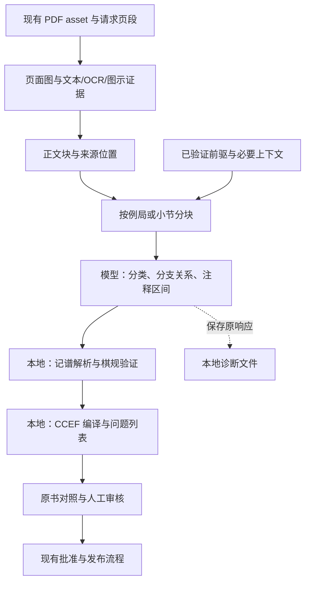

# ADR 0022：面向个人使用的 PDF 提取重构与分步开发设计

- 日期：2026-09-24
- 状态：v8/v9 独立及增量流程已于 2026-10-01 获个人使用验收；R5/P6 广泛质量验收暂缓。当前运行边界见 [PDF 架构现状](../architecture/pdf-extraction-current.md)。
- 最新证据与调整：[两次网页实跑及后续方案](../agent/pdf-v6-latest-runs-and-next-design-2026-09-25.md)。
- 下一轮执行顺序与验收：[R1–R5 计划](../agent/pdf-extraction-r1-r5-plan-2026-09-25.md)；当前执行证据见 [实施记录](../agent/pdf-extraction-r1-r5-implementation-2026-09-27.md)。
- 实施进度：[阶段记录](../agent/pdf-extraction-progress-2026-09-24.md)。
- 依据：[失败诊断](../pdf-extraction-diagnosis-2026-09-24.md)、[当前 P6 样本清单](../pdf-extraction-evaluation-set-v1.json)；[v0 清单](../pdf-extraction-evaluation-set-v0.json)保留原始七本书库存记录。
- 若实施，将调整 ADR 0014 的模型输出职责、0018 的生成/续接方式及 0021 的新任务恢复策略。
  历史工件与读取方式保留；不静默改写已接受 ADR。
- 开发尺度遵循操作者本轮要求：个人网站，简单可用优先，针对实际问题验证，不追求全局完备性证明。

## 2026-09-27 实施记录

v8 将来源关系解释单独版本化，模型返回来源 game/line/segment 和明确入口；本地按引用
装配父节点、棋规及 CCEF，不让旧的最近合法节点修复链覆写关系。来源样式和连续前后文随请求保存；
必要时对局部入口做一次有界补问，保存响应可无付费重放。`semantic_manifest` 及新读取页
已接到原有 SQL Job、审核和浏览器，旧结果读取仍保留。以上是已实施行为；下面早期章节的
“拟新增”“若实施”等表述保留为设计历史，不代表当前未接线。

两本新网页开发样本的已核对来源锚点明显改善；完整质量与六书 P6 仍需按执行计划继续评估。
人工审核仍是正式知识库发布边界。当前详细数据和局限见实施记录。

## 2026-09-27 审核修入口后的依赖重放

v8 审核增加一个已有修订上的显式操作：人工先改挂有来源的入口棋步，程序从该运行保存的关系响应中定位对应来源 token，生成局部关系补丁，重编译依赖，再与当前审核修订合并。模型响应仍是只读来源材料；合并以来源出现与完整父链对齐，人工棋步、文字、评价和有冲突的修改优先保留。用户必须先看候选并显式确认；确认时复算候选且核对版本与哈希，沿用不可变审核修订及撤销。该流程不自动发布，也不引入第二个通用修复框架。

首版只接受可定位到保存来源 token 且挂到既有线路尾部的改挂。全局格式猜测、局面可走性或剩余独立错判不会被当成可靠恢复依据。验证与具体限制见 [审核恢复记录](../agent/pdf-review-dependency-replay-2026-09-27.md)。

## 1. 核心决定

**保留现有网站和领域架构，重构提取路径。模型负责读懂局部内容，程序负责装配合法结构。**

不重写 Position/MoveEdge、课程、训练、引擎、人工审核账本。CCEF 1.1 继续作为审核和交换格式，
不再要求模型一次直接生成完整 CCEF。新流程仍在现有后端单进程、SQL Job 和本地文件存储中运行。

成功标准是：能读到与原书相符的主线、变例和注释，少量疑点可定位和人工处理；不以 JSON 通过、
测试数量或全部内容降级成 unresolved 代替提取质量。

与上一轮诊断方案相比，本设计进一步收窄第一版：先做两个样本的小闭环；不先标完 21 个窗口；
不增加四套质量状态；不先建设每个纯函数步骤的审计账本、通用工作流引擎或自动崩溃恢复。

## 2026-09-25 补充决定：自动阅读提示与整段关系装配

后续与操作者讨论后，取消“先由用户配置各书颜色／粗体格式”的方案。
新路径保留 token/span 样式，在有代表性的页段上自动观察本书排版，得到带来源例子的简短阅读提示；
结合自然语言、回合号、段落和局面解释整段关系。提示可因局部反例而调整，不是硬性模板或书名特判。
无需每页额外调用模型，也不先建设通用学习框架。

先明确各例局的来源主线与分支作用域，再为整段变化寻找候选挂接位置。合法性是必要检查，不能替代
来源归属；不得以最近同色合法位置强行消歧。改挂后刷新相关局面再判断后代，停止使用过期状态。
跨块保留来源进度与未闭合分支；不能仅靠最近16个合法节点及已经出错的 sibling_order 推导主线。

用户通过“恢复主线／独立示例／计划／从这里分支”纠正内容，不输入内部 ID 或编写格式规则。
可视化整段转移、跨序列修复与撤销／恢复复用不可变审核修订，不自动批改全书或绕过人工发布。
本补充更新后续实现目标，不声明这些功能已经完成；细节与 R1–R5 逐步验收以执行计划为准。

### 2026-09-26 协议细化（架构草案，未实施）

[关系协议与装配规则](../agent/pdf-extraction-relation-protocol-2026-09-26.md) 明确 R3 的输入／输出和职责。
模型仍负责回答“哪一局、哪条线路、替代谁、返回哪里”，按来源 token 引用声明连续片段的入口关系；
程序计算 root/continue/alternative_to/branch_after 对应的父节点，段内顺序连接并验证棋规。
首次主线也由模型根据来源提出，不能假设程序已拥有一棵正确的树。

输入采用固定任务指令加来源 JSON：保留原文/字符样式、来源 token、相关既有线路/作用域、
已知起局和自动阅读提示；区分当前待解释范围与只读前文。协议草案第3节提供具体格式和
与输出对应的完整例子。当前文本 provider 不直接传 PDF 或截图，既有线路目录也不是语义真值。

随后讨论进一步明确：阅读范围和 owned 输出范围分别设定。优先给模型连续的本局/本节原文，
包含前后文；只输出有界的 owned 内容。预算不足才做重叠阅读窗口，不能仅依靠模型已给出的
线路摘要检索零散证据。协议第3.4/3.5节记录实际两次运行的单页小块输入及对应修订，未实施。

调用成本进一步明确：按完整讲解段合并输出，不把每页一次当默认；需要分批时，将稳定来源正文/
token目录前置，逐轮结构/owned范围后置，以便官方DeepSeek前缀缓存复用。命中非保证，不能替代
减少重复推理；在现有工件保留实际用量即可。协议第3.6节附官方规则、计价来源和验收要求，未实施。

语义选择可在棋规全部合法的情况下出错；引用校验与 python-chess 只证明结构／棋规一致性，
不证明作者归属。新协议需独立的版本读取及装配接缝，不经旧逐节点自由 relink 再改写；
相关草案供当前架构讨论使用，不表示已验收或已经实现。

## 2. 文件重构清单

路径简称：`extraction/`、`services/`、`schemas/`、`review/` 均位于
`backend/src/chess_workbench/`。表中是目标改动边界，不是本轮已修改清单，也不要求一次改完。

| 现有文件 | 处理方式 | 目标职责和实施时机 |
| --- | --- | --- |
| `services/pdf_extraction.py`（当前 1,559 行） | 主要重构 | 保留 Job 入口及历史版本分派；逐步抽出共享证据准备和新候选生成，避免继续在主 handler 堆分支。P1 只建立必要接缝，P5 接网站。 |
| `services/pdf_incremental_extraction.py` | 主要重构 | 保留前驱加载、追加和 document head 提交；调用同一个新解释/编译流程，仅额外传入 continuation context。P4–P5。 |
| `extraction/prompting.py` | 新流程替换其职责 | 历史 CCEF prompt 保留；新 prompt 只返回来源片段的语义判定，不要求长 hash、bbox、metadata、三份平行集合。放入 `interpretation.py`。P1。 |
| `extraction/candidates.py` | 收窄并复用 | 复用摘要、canonical bytes、工件打包；为本地编译结果增加明确入口，不把本地 CCEF 冒充模型原响应再走旧 repair。P1、P5。 |
| `extraction/coverage.py` | 新流程替换核心逻辑 | 新检查区分 playable score、alternative、plan、prose、unknown；只报告具体遗漏/疑点，不以 regex 零 gap 作为整段成功前提。新逻辑先放 `compiler.py`，避免同时改坏旧流程。P1–P2。 |
| `extraction/recovery.py`、`general_repair.py`、`repair.py` | 停止作为新流程主链 | 新路径不再串联完整 CCEF → 通用 JSON Patch → 全量复验 → coverage 补丁；只允许一次针对具体小块的补充判定。旧工件需要的重放代码保留。P2。 |
| `extraction/structural_recovery.py`、`annotation_windows.py` | 复用算法，不沿用恢复协议 | 将选来源区间、本地复制原文用于正向注释提取；不再先生成悬空 annotation ID 再补正文。只在确有复用时抽出小函数。P1–P2。 |
| `extraction/pdfium.py`、`evidence.py` | 渐进增强 | 原图/原文/hash 保留；新增块与来源映射在内部 draft 模型里表达，必要时才扩展 renderer 输出样式。P3 处理已观察到的双栏、乱码、断词。 |
| `extraction/paddleocr.py` | 有样本证据再改 | 先实测中文扫描页；调整触发和输入输出适配，只有效果不足时再评估替换。OCR 本体不在第一轮重写。P3。 |
| `extraction/diagram_context.py` | 小范围重构 | 消费统一记谱 token；起始图与中途校验图分开，未知行棋方保留疑点。`diagram.py`、`diagram_onnx.py` 优先原样复用。P3。 |
| `extraction/consolidation.py` | 新流程削减依赖 | 保留历史结果合并；新流程从来源事件生成棋谱，尽量不再靠事后合并大批重复树补救。重复印刷保留 mention，跨局不按 FEN 混并。P2、P4。 |
| `extraction/incremental.py` | 复用并收窄输入 | 保留已验证 continuation 和确定性组合；传相关例局/分支上下文，避免重复发送整份历史候选。P4。 |
| `extraction/provider.py`、`deepseek.py` | 大体保留 | 继续使用现有传输接口；只补实际发出的有效参数、finish reason、token 用量记录，按观察处理兼容问题。P2。 |
| `extraction/contracts.py`、`decoder.py`、`validation.py` | 保留核心 | CCEF 1.1、旧响应解码和 python-chess 继续使用；新增内部 draft schema，不把所有阶段塞进 CCEF，不放松正式数据校验。 |
| `services/ccef_failure_debug.py` | 简化扩展 | 每次模型请求保存脱敏请求信息、原响应、问题摘要；后续失败不丢前面的成功响应。无需为每个本地函数新增一套 receipt。P2。 |
| `services/pdf_review.py`、`review/inspection.py` | 有限适配 | 识别新 pipeline/result，读取合法的 partial 候选；来源查看不依赖整段 CCEF 成功；把局部待处理棋谱映射到现有 review issue。P5。 |
| `schemas/review.py`、`review/editing.py` | 补齐必要人工操作 | 解析 unresolved 为正文/注释/线路、修正起局、重挂变例，复用既有审核 revision；不能只允许排除内容。P5。 |
| `services/pdf_persistence.py`、`store/models/extraction.py` | 集成时的小改动 | 原型阶段不改 SQL；P5 增加一个运行 manifest 工件类型及必要迁移，不新增 block/job 状态表。 |
| `schemas/pdf.py`、`schemas/pdf_documents.py`、`api/pdf.py` | 集成时的小改动 | 增加新结果摘要及错误位置，复用原提取/追加入口；仅在公开结构变化时生成前端类型。P5。 |
| `frontend/src/app/SourcesPage.tsx`、`PdfReviewPage.tsx`、`logic/api/client.ts` | 有限适配 | 显示完整/部分结果、未处理位置与原因，并进入现有审核页；按具体问题提供操作，不重写页面布局。P5。 |
| `services/pdf_review_ledger.py`、`pdf_review_publication.py` | 默认不重构 | 继续消费审核修订；若新 issue 必须适配，仅调整 owning boundary。禁止把提取改造扩大成课程/账本重写。 |
| owning extraction tests、`scripts/`、`Makefile` | 随行为更新 | 增加一个本地 evaluation 入口和必要回归；旧读取测试保留，新路径不照抄全部旧 recovery 测试矩阵。 |

旧恢复代码从新路径退出，不等于立即删除文件。新流程稳定后再单独决定是否清理；不为清理而
搬动大量文件、重命名公共接口或重算历史工件。

### 新增模块的最小划分

这些是逐步增长的责任边界，不先创建空文件或基类。

| 拟新增文件 | 唯一主要职责 |
| --- | --- |
| `extraction/draft.py` | SourceSpan、Block、Chunk、Interpretation、Issue 的少量内部数据类型。 |
| `extraction/blocks.py` | 原证据到有序正文块、已知字形规范化、语义分块与来源映射。 |
| `extraction/interpretation.py` | 构造局部请求、解码语义判定；必要时对一个疑点补问一次。 |
| `extraction/score.py` | 记谱 token、分支/主线恢复、用 python-chess 解析候选路径。 |
| `extraction/compiler.py` | 生成 CCEF ID、引用、annotations/reading_flow，检查来源去向并生成质量摘要。 |
| `services/pdf_extraction_pipeline.py` | 顺序调用以上函数，复用证据和 provider；不拥有第二套 Job 生命周期。 |
| `scripts/evaluate_pdf_extraction.py` | 本地真实样本/已存响应比较；默认离线，真实调用显式启用并指定预算。 |

P1 中同属一个简单职责的小函数可以先放一起；只有可读性或实际复用需要时才拆分。不按一个类一个文件。

## 3. 新架构与数据流

每个请求窗口默认一次语义调用，窗口含若干相邻块及上下文；遇到明确局部疑点才考虑一次补问。布局、棋谱和质量检查不是各调用一次
大模型；它们大部分是普通函数。按顺序执行，复用现有 worker。

### 3.1 证据和正文块

先读取现有 evidence，建立短 ID，例如 `b12`；保留到原始 `(page, fragment hash, text range)`
的映射。模型只需选择短 ID/来源子区间，本地负责 hash、bbox 和最终 EvidenceRef。

正文块可为标题、正文、棋谱、图示或 unknown。同一段内的棋步和说明允许按 span 切分，不能只做
整段二分类。规范化只针对已观察到的字形、回合号和断词；原文与规范化文本映射保留。
首次使用 fragment 级定位也可接受，精细字符 offset 在需要混合段切分时再补。

普通可读文本先走现有文本层；扫描页走 OCR。P3 再加入必要的列顺序、字体噪声和图注处理。
不先实现通用文档版面系统或“所有 PDF 类型兼容层”。

### 3.2 分块不是任意切页

按标题、例局和棋谱段落定位边界，长度过大时在段落边界切开。建议首轮用 1–4 页左右做实验，
实际输入/输出限额才是预算控制，页数不是正确性规则。

每块有 `owned_spans` 和 `context_spans`：正文只归属一个输出块，上下文只读不重复输出。
按2026-09-26补充设计，1–4页只是早期实验建议，不能当阅读范围上限；连续原文可以覆盖更大
页段，含后文，输出仍分块。跨块保留当前例局、来源主线进度以及尚在解释的分支，不因其暂时
非法就丢掉来源身份，也不能只传最后一个 FEN。缺少父局面时
标记 missing_context；不凭着法逆推一个貌似合理的初始局面。

2026-09-27 P6 实跑补充：只读来源页和**已建立的前驱线路**不是同一回事。v8 关系编译器
只接受 `state.parent` 已拥有的棋步作为 `continue`／`alternative_to` 锚点；即使模型能读到
前页 OCR，也不能把未解释的前页 token 当成已验证父节点。中途续局的首轮应优先覆盖完整
本局／小节并保存关系；后续 owned 窗口可复用这份已编译前文及边界 FEN，或直接引用已确认
图示 FEN。只读前后文继续提供语义判断，但不能替代前驱状态。实现验收需用“前页有完整
棋局、当前页从中途续入”的跨页样本，检查前页关系不重复成为本次 owned 输出、后页分支
仍可引用正确且合法的前驱。先实现这一点，再开放浏览器的额外阅读页范围设置。

大部分边界用本地信息确定；识别不准时允许小块保留 unknown 并继续，不增加专门的分块模型代理。
P1 先使用人工选定完整片段，P4 再验证自动分块和跨段行为。

### 3.3 模型到底输出什么

模型输出有序语义事件，例如：

- 某个来源 span 是主谱；
- 某段是从前面某个 move token 分出的变化；
- 某段说明对应之前或之后的局面，或者锚点不确定；
- 某些招法是备选项/计划引用，不是连续可播放棋谱；
- 这里恢复主线，或者开始新的例局。

模型可引用预分配的 token/span ID 以及显式前驱锚点。仍有语义关系需要模型判断，但它不再复制
整套节点内容、ID、证据及 reading_flow。通常只返回一份事件序列；注释正文由本地从来源复制。
复杂语义只在这个接口表达一次，不能在之后的正则 coverage 层重新推翻为另一套定义。

内部 schema 仍拒绝未知字段，但允许显式 unknown/ambiguous。语义错误按事件及其依赖隔离；
坏 JSON 影响当前请求窗口，原响应保留；
不能靠删除不认识的字段来宣称解析成功。

### 3.4 棋谱解析和 CCEF 编译

本地先识别记谱 token，再结合事件指定的主线/分支上下文和 python-chess 解析。
同一棋步在多个父局面下都合法时，合法性不足以决定归属；需要来源语义，不能任取一个。

编译器一次生成节点与阅读流，程序负责 parent/sibling/ID 关系。原始阅读序列和棋局拓扑
分开保留。同一步被书中重复提到时保留 mention，不重复复制整个路径。为适配 CCEF 1.1，
重复展示可保存为带来源 prose；无法表达的复杂次序先显式待审，不抢先升级公共 CCEF 格式。

`raw_ccef` 在新版本中明确表示本地编译、棋规规范化前的 CCEF；实际模型输出是 interpretation，
另存原响应。两者来源必须区分。新结果不走旧 `_decode_fragment_bound_response_v1_1` 后再
清空 compiler 已计算的 offsets；直接验证本地映射，复用纯规范化/摘要/序列化函数。

未理解的可信原文转为 unresolved；不接受模型发明的原文、未知来源引用或权威棋规结果。
未知棋谱片段仍是审核问题，不能为了减少错误计数伪装成普通、已完整提取的正文。

### 3.5 失败与状态：只保留必要区分

| 情况 | 行为 |
| --- | --- |
| 一处计划/注释锚点不确定 | 保留内容与位置；展示局部 issue，不让整个页段失败。 |
| 某块模型输出缺失、坏 JSON 或耗尽预算 | 保存响应；有可用证据则形成 unresolved，其他块继续；若是全局认证/配置错误则停止后续调用。 |
| 缺 OCR 等依赖 | 扫描内容标 unavailable，已有可用内容保留；不把空内容当成功提取。 |
| PDF 读不出、无法写入工件、内部程序错误 | Job 明确失败，不通过 catch-all 把程序 bug 伪装成内容不确定。 |
| 局部候选绑定到不存在的来源 | 丢弃该不可信 proposal，保留真实来源待审；不保留错误绑定。 |
| 有未解决棋谱、未知起局或缺失正文 | 可以查看，依照既有审核规则不能直接发布。 |

沿用 `queued/running/succeeded/failed/cancelled`。Job succeeded 只代表运行完成并保存了可读候选。
新候选摘要只增加 `completeness: complete | partial`，配合现有 issue/unresolved 计数；
`complete` 表示未发现缺失，不承诺语义绝对正确，也不等于审核批准。无可用候选时 candidate 为 null。
全 unresolved 可以保留供查看，但必须 partial，评测按不可用提取计算。

合法 partial CCEF 继续走现有成功 Job 的审核入口；无需发明“failed Job 直接发布”的特殊路径。
内容不完整的阻断由 review inspection 拥有。解析阶段不逐层重复执行所有发布规则。

### 3.6 存储和兼容：做最小必要改动

P0–P4 的实验结果先放 gitignored 本地目录，原始 SQL/历史任务不改。
P5 接入时为新 pipeline/result 定版本，旧 provider/raw/normalized 工件按旧版本读取。
同一本书、同一范围的新请求产生新 run，旧失败记录不伪装成被修复。

现有 `ExtractionArtifact.kind` 有 CHECK 约束，不能随意写入新 kind。建议仅增加一个
`extraction_manifest` 类型及迁移：最终 manifest 引用各块的 evidence/proposal/response 工件、
问题摘要和有效模型参数。普通数据仍存现有 CAS，不新增 Block/Chunk/Stage SQL 表。
新版本 `provider_response` 可为有明确 schema 的多次响应清单，读取器按版本识别，不伪装成单次响应。
结果 loader 中的 `_RESULT_KEYS`、`_CANDIDATE_KEYS` 和 pipeline allowlist 同步适配。

每次实际 provider 返回后立即保存原响应，最终形成一个运行摘要即可。纯本地函数不各建一套审计
协议。首次不承诺崩溃后自动从任意步骤恢复；保存的数据可由离线脚本重放。自动断点恢复、网页内
单块重试只有在实际使用证明必要时再开发，并产生新结果身份，不能覆盖已有审核基线。

### 3.7 图示起局：现有能力与保留边界

现有 `diagram_onnx.py → diagram_context.py → initial_position.kind=fen` 已支持从书中图示起局，
不需要补造从第 1 回合开始的走子历史。本轮只读复查 Endgame Strategy p19–22 的成功 run
`976c919a-ce51-576b-ad77-be9284d6ad47`：四页各有一个 diagram evidence，四个 operational FEN
均非空；normalized CCEF 有两条从 FEN 开始的棋谱，共 102 nodes，分别从第 36、53 回合起。
四张图不代表四个新例局，其中有中途局面图。

现有实现要求本地识别模型可用；从图识别棋子摆放，再用附近编号着法及英文行棋方图注确定可操作
局面。它会选首个能通过候选方向合法性检查的着法，不等于对整个上下文唯一性的全局证明。
当前回合号正则只处理有限 ASCII 格式；中文图注、Unicode 棋子、图上教学标记及版面邻接仍需样本验证。
图本身不能证明易位权、吃过路兵和半回合钟，当前代码使用无/无/零并在 evidence 记录假设。
这些缺省不能被当作图中识别出的事实。

新流程保留三种起点：标准初始局面、已识别/人工确认的图示局面、已验证的前驱棋谱局面。
中途示意图优先校验当前线路，不能每遇到图就重开一局；未知图示留下原图供人修正摆放或输入 FEN。
只有使用该图作为起点的线路依赖它，其他例局继续处理。

### 3.8 正文块不是单标签：块内有序结构与跨块上下文

应区分三个概念：

- **版面块**：PDF 中的一段/一行/一个区域，是证据容器，可以混有主线、说明和多级变化。
- **语义片段**：块内的某段原文或几个着法；一个版面块可解析出多个事件与关系。
- **请求窗口**：一起送模型理解的若干相邻块，加例局起点、相关前文和分支上下文。
  模型调用按请求窗口进行，不是每个文字块独立调用或只打一个标签。

模型做的是“片段划分 + 内容解释 + 关系解析”。本地 token/span ID 只定位，不预先决定分支含义。
混合段内的开始变化、切换同级变化、结束变化、恢复主线，以及说明锚点，必须可表达。
主线和变例的层级相对当前例局/分支定义，不能用一份平面 `block_type=variation` 代替。
程序维护当前位置和分支栈，并用本地棋规检查模型提议的关系；颜色、粗体、括号、回合号和语言
是辅助证据，没有任何一个标点独自决定树结构。

以下是已读本地样本的目标解释，页码均为 PDF 物理页；它们不是新算法已通过的结果：

| 书/页 | 混排形式 | 新解释必须表达的关系 |
| --- | --- | --- |
| Makogonov p7 | 主线 `6...c6` 后，文字引出 `6...c5 7.d5 e6 (7...b5 ...) 8.Bd3 ...`，接着回到 `7.Bd3` | `6...c5` 是 `6...c6` 的同级备选；`7...b5` 是变化中 `7...e6` 的备选；括号后的 `8.Bd3` 继续 e6 分支；下一段 `7.Bd3` 恢复 c6 主线。 |
| Chess Bible p20 | `15...Rf7!` 主谱，正文里的 `15...h5 ... 17...a6 [17...Bd7? ...; 17...Rf7 ...]`，随后 `16.Kh1` | h5 是外层变化；方括号内 Bd7/Rf7 是 a6 的两条同级备选，不是彼此接续；16.Kh1 恢复最初 Rf7 主线。 |
| Catalan p7、p9 | 双栏、问答、同回合备选、跨回合的单方计划 | `9...dxe4`/`9...Na6` 是 alternatives；`17...Nc4`/`18...Nxe3` 是缺对手应手的计划；均不能强制拼成连续父子路径。 |
| Scandinavian p319–320、p225 | 无点回合号，正文中的走子次序/计划及完整短变化并存 | 识别 `1 e4` 等记谱；计划文字保留，具备上下文的完整短变化可挂接；主谱不能因为说明段结束就丢失原来位置。 |
| Endgame Strategy p19–20 | 图示起局；主谱 `36.Rxe6?` 被说明和 `36.Kf2!` 变化打断，之后再次打印 `36.Rxe6? Kf5!` | 从图示局面分出两条路线；后一次 Rxe6 是恢复并重述主线，不再执行一次同样着法。 |
| Attacking Chess p20 | `3.♕xd8+!!` 后，正文插入 `3.♖e1 … 3…♖e8`，再出现 `3…♕xd8 4.♗xe6#` | 保留符号原文，同时规范化 token；Re1 分支从白方第 3 步之前分出，最后 Qxd8 是主谱对白后牺牲的应手。 |

这套表示能够表达这些结构，不意味着模型每次都能识别正确。P1/P2 先验证一个有嵌套/恢复的
混排实例，P3 扩展其他格式；不能用全是线性棋步的示例来验收所谓“支持变例”。

### 3.9 局部失败必须同时做到可看、可定位、可修

“保留 unresolved”本身不够。针对操作者反馈，以下作为 P2/P5 的实际交付要求：

1. **可看**：在证据已经生成的前提下，来源页/可信原文的查看不依赖整个 CCEF 成功。
   有有效片段时产生合法 partial 候选；整窗响应坏 JSON 时显示该窗原文和问题，不能假装
   已抢救出未完整解析的节点。公共查看面不直接暴露原始 provider body 或文件路径。
2. **可定位**：问题指到页、来源片段和相关线路；能从问题跳到原文，区分“缺正文”“父节点不明”
   和“起始图未确认”。原始失败信息与已成功片段均保留。
3. **可修**：现有命令已有 add_line/delete_subtree/promote/make_mainline/edit_text/exclude_item，
   但没有把 unresolved 转成正文/注释/棋谱的操作，没有改起始 FEN 或重新挂接父节点的操作。
   必须在现有 `schemas/review.py`、`review/editing.py`、审核 service 与 UI 增加最小语义操作：
   解析待处理片段（可成为正文、注释、接到已有局面的线路或从确认局面开始的新序列）、
   修正起始局面、重新挂接变化。复用既有 expected-version 和审核 revision，不另建编辑系统。
4. **相关局部重算**：人工修正只重算受影响的序列/子树，并更新注释锚点和阅读流；不重提整本书。
   最终保存仍检查修改后 CCEF 的结构和相关棋规，不能仅改 UI 显示。重挂/改起局不能静默删注释。
5. **按依赖隔离**：错的是支线着法，则该支线及依赖后续待审，主线与其他支线继续；错的是主线
   起点/中间一步，则依赖它的后续不能假装已合法解析。新例局或具有独立可信起点的后段仍可处理。
   当一个事件无效时，可解析的事件列表按记录隔离，不因一条未知 anchor 抛弃其余无关事件。

这要求新 interpretation 的有效 envelope 与每条语义事件分开验证；不是把原来整包失败换成
另一个更小的整包失败。纯语法无法解析的响应只能退回该请求窗口的原文，不能承诺任意损坏 JSON
都可恢复。编译器自身 bug、读写故障继续显式报错，已生成来源仍可查看。

人工排除是一种选择，但不能成为上述三类缺失编辑能力的替代品。网页内再次调用 AI 只修一块
仍可后置；**查看部分成果和人工修复是第一版网站集成的必需功能**。这些是针对已发生故障的
产品能力，不需要扩展为通用 JSON 编辑器、自动修复框架或大量异常组合测试。

## 4. 分步开发模式：按可见结果推进

一个步骤可以涵盖完成该结果所需的几处相关文件，不按每个函数/类型拆十几个验收包。
每轮只维护“目标样本、用户看到的改善、改动边界、最小验证、剩余问题”五项。

| 步骤 | 完成后能看到什么 | 主要边界 | 够用的验证 |
| --- | --- | --- | --- |
| P0 样本与基线 | 两个固定片段的原书/旧输出/目标行为对照：Catalan p6–9 和 Scandinavian p319–323；只标主线、关键变例、注释和已知反例。 | 本地样本标注、evaluation 脚本；不改产品。 | 离线回放和人工核对；先不建设完整评测平台，不要求先标完 21 窗口。 |
| P1 最小闭环 | 一个片段从现有 evidence 经语义事件、本地棋规和编译，得到可读 CCEF：主线、一个真实变例、正文注释。 | draft/interpretation/score/compiler 的最小实现；必要的候选复用接缝。 | 比较原书和 pretty JSON/现有只读展示；一条合成主线带嵌套变化及主线恢复的回归，相关格式/类型检查。真实调用显式限定范围与预算。 |
| P2 局部不确定可用 | 两个片段都可读；计划不强制变例、annotation 不再悬空；一处失败不丢掉其他成果。 | compiler、局部补问、诊断保存；新路径退出旧 repair 链。 | 两个已知 coverage 反例和一例坏事件旁仍有有效主线的局部缺失；人工检查注释与分支，已通过检查无改动不重复跑。 |
| P3 扩展到代表输入 | Makogonov、Endgame、Unicode 记谱和中文扫描的代表片段可处理，或能准确指出未识别区域。 | blocks、pdfium/OCR 触发、diagram_context、统一 token。 | 合计 6 个代表窗口做本地观察；每类实际修复补 owning regression，不组合穷举所有版式×语言×引擎。 |
| P4 分块与续接 | 一个例局跨两个块/页段继续，独立新例局不误接，正文不重复。 | blocks/chunking、incremental、新共享 pipeline；相关分支上下文。 | 一例跨界主线含变化 + 一例新例局；复用现有组合测试，不为每个 chunk 新造 Job 状态机。 |
| P5 接入网站 | Sources 可发起新提取；展示完整/部分结果，审核页能定位缺失，补齐片段、修正起局或重挂变例；来源查看不依赖整段成功。 | 两个 Job 入口、manifest 迁移、result/API、review 语义命令、Sources/PdfReview。 | 一次本地闭环；owning API/UI 测试；有 schema 变更才生成/检查类型，有迁移才验证空库与一个既有 SQLite 样本升级。 |
| P6 一次收尾评估 | 汇总当前六本书的 18 窗口结果，决定是否切换新默认；记录剩余限制。中文残局书的三个窗口按操作者要求暂不纳入测试。 | 固定版本的本地评测、适用 Stage gate、文档。 | 标注/检查留出窗口后统一对比；此时运行相关阶段验收。全仓 verify/smoke 只在用户要求、全局影响或阶段收尾确有需要时执行。 |

P3 的 OCR/布局改动可因真实样本暴露的问题提前，但不因此把整个阶段重置为“必须先建设通用框架”。
P6 的当前 18 窗口是有界的收尾评估，不变成每次提交的 CI 负担，也不要求反复购买模型输出。原 21 窗口见 v0 清单。

每轮验收后只记录观测结果，不把一次成功推广成全书保证。真实模型调用总是记录全部尝试，
不只留下最好一次。已有授权覆盖的范围内直接继续，无需每个内部小步骤再次请求确认。

### 评估重点与停止条件

优先看五件事：主线是否完整、分支是否挂对、注释是否保留、幻觉/遗漏在哪里、人工修订是否更省力。
记录 token/调用次数和耗时，但不先搭仪表盘。全 unresolved、合法却错误的路径、丢正文后的“成功”
不计质量提升。

上一轮报告中的 99%/95%/成本减半是探索目标，不是每小步的硬门槛，更不是要求通过大量测试证明
全局完备。P0 用实际样本建立基线；P6 报分子/分母和逐例差异。若 P1/P2 无可见改善，先调整
语义接口，不继续大规模改数据库、UI 或 OCR。

## 5. 个人项目的开发要求（立即适用）

1. **结果优先。** 先让一段真实棋书可读、可检查，再扩充覆盖面。非关键问题允许记录后续处理。
2. **验证放在边界。** 文件/provider 输入、棋规、正式持久化/发布是必要边界；内部已验证对象
   不反复做完整 schema/hash/图一致性检查。具体复验只因对象发生相关改变或来自外部。
3. **必要规则不等于层层阻断。** 持久化棋步合法、来源真实、不覆盖历史、人工批准继续保留；
   启发式解析不确定性应成为局部问题，不添加无依据的整段失败条件。
4. **简单实现。** 优先现有函数、少量 typed models 和顺序执行。没有实际第二种用途时，不造
   插件系统、策略注册器、多代理协作、自动回退模型链、通用 repair/workflow 框架。
5. **测试按风险选。** 小 bug 默认一条关键回归；不可逆写入加对应集成测试；普通文档、文案和
   可逆展示调整可直接检查。不写照抄实现的断言，不为假想输入穷举组合矩阵。
6. **区分三个验证节奏。** 编辑期间做局部快速检查；一个可见切片完成时跑相关测试；Stage/CI
   收尾才做较大验收与覆盖率。不对每个小改动跑全仓或累积 Stage gate。
7. **允许人工样本验收。** 棋书语义正确性可以通过原书与输出对照确认；确定的 bug 再变成小回归。
   人工判读不能替代持久化关键约束测试，但也不被自动化矩阵排挤掉。
8. **检查通过就推进。** 没有新改动、新失败或明确未解决疑点，不为安心重复/扩大验证。
   现有覆盖率与 lint 门槛留在应运行的门禁里，不通过削弱它们获取绿灯。
9. **进度不按测试数汇报。** 每轮说明样本改善、改动文件、已跑检查及限制。不要把大量检查日志
   当作功能进度，也不要以准备更多基础设施长期推迟真实提取结果。

这些规则同步到 `AGENTS.md` 和 `docs/development-plan.md`。后者原先“每一步必须通过阶段验收”
及“人工验收只限视觉文案”的要求在本轮修正，避免旧文档继续诱导过度测试。

## 6. 后果与本轮交付

预期收益是减少模型输出负担、避免机械引用失配、缩小语义错误影响范围，并让人工审核真正承接
不确定性。代价是新增一个轻量内部 draft 与本地 compiler，接网站时需要一次小迁移和版本化结果适配。
语义识别、布局和图示仍可能出错，本提案不承诺完全自动化。

本轮只更新本设计、ADR 索引、当前计划入口、开发要求与 handoff；未修改业务代码或运行模型。
下一步的具体开发单元是 P0 两个样本的最小基线，然后 P1 的单片段闭环。
